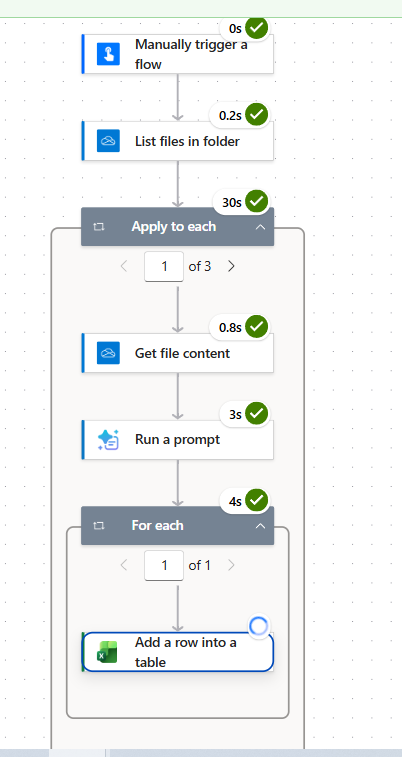
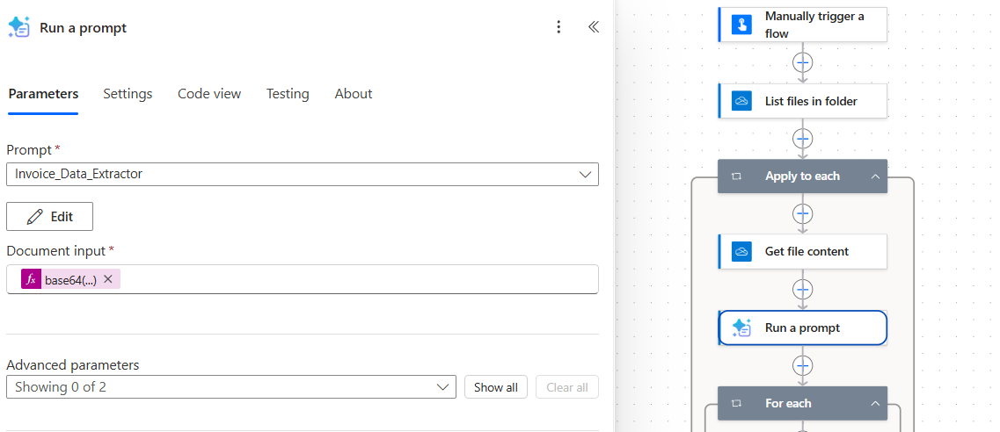
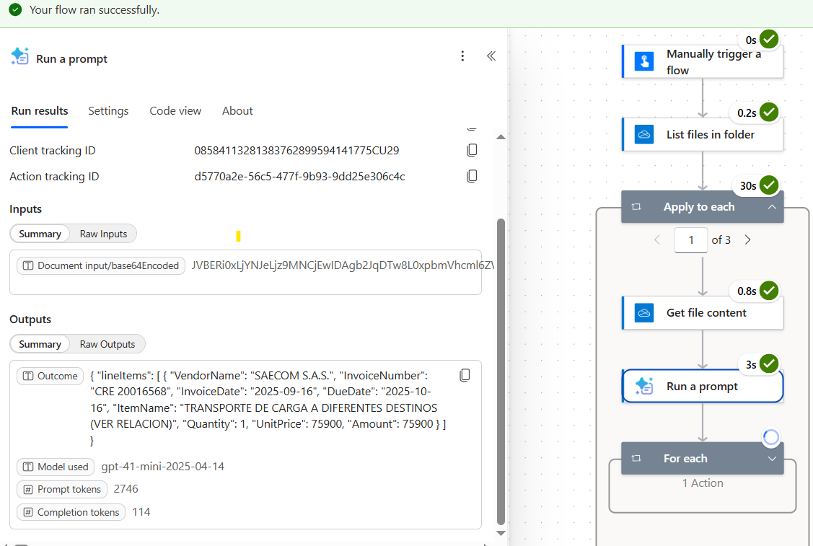
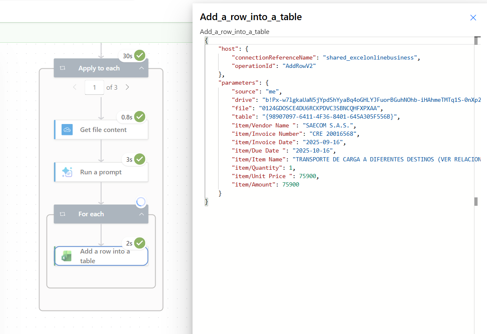
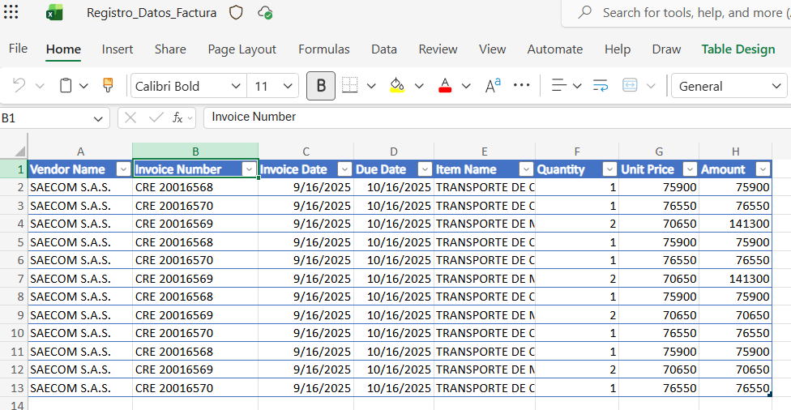
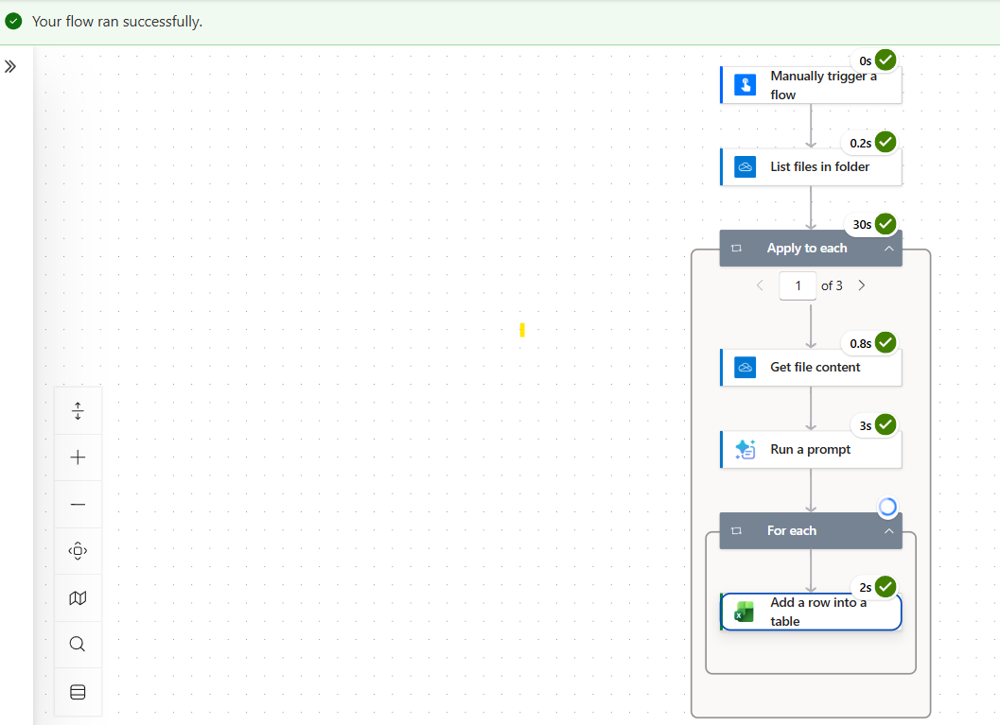

# Intelligent Invoice Processing with Power Automate & AI

> From unstructured invoice documents to structured business data.

## Overview

This project demonstrates the design of an intelligent document processing pipeline that automates the extraction and registration of invoice data.

The solution combines Microsoft Power Automate and AI Builder to process invoice documents stored in OneDrive, extract relevant information using AI, transform the result into structured JSON and register the information in an Excel table.

The objective is to reduce repetitive manual data entry and transform unstructured documents into structured business information.

---

## Business Problem

Organizations may receive invoices from multiple suppliers in PDF or image format.

In a manual process, an employee must:

1. Open each invoice.
2. Read the relevant information.
3. Identify fields such as supplier, invoice number, dates and amounts.
4. Enter the information into a spreadsheet.
5. Repeat the process for every document.

This type of process is repetitive and can introduce data-entry errors.

The proposed solution automates the document processing pipeline.

---

## Solution

The solution transforms the invoice processing workflow from:

```text
Invoice
   ↓
Manual Reading
   ↓
Manual Data Entry
   ↓
Excel
```

### Into

```text
Invoice
   ↓
OneDrive
   ↓
Power Automate
   ↓
AI Builder
   ↓
Structured JSON
   ↓
Excel
```

The automated workflow is divided into three main stages:

### 1. Document Acquisition

Invoices are stored in a designated OneDrive folder and retrieved by the Power Automate workflow.

### 2. Intelligent Extraction

AI Builder processes the invoice document and extracts relevant information using an AI prompt designed to return structured data.

### 3. Data Registration

The extracted information is transformed into structured records and registered in an Excel table.

---

## Architecture

The solution follows a simple document processing architecture:

```text
                ┌───────────────┐
                │    Invoice    │
                │ PDF / Image   │
                └───────┬───────┘
                        │
                        ▼
                ┌───────────────┐
                │    OneDrive   │
                │  Document     │
                │    Storage     │
                └───────┬───────┘
                        │
                        ▼
                ┌───────────────┐
                │ Power Automate│
                │ Orchestration │
                └───────┬───────┘
                        │
                        ▼
                ┌───────────────┐
                │   AI Builder  │
                │  AI Prompt    │
                └───────┬───────┘
                        │
                        ▼
                ┌───────────────┐
                │ Structured    │
                │     JSON      │
                └───────┬───────┘
                        │
                        ▼
                ┌───────────────┐
                │     Excel     │
                │ Business Data │
                └───────────────┘
```

---

## Implementation

The Power Automate workflow follows this sequence:

```text
Manual Trigger
      ↓
List Files in Folder
      ↓
Apply to Each File
      ↓
Get File Content
      ↓
Run AI Prompt
      ↓
Process Structured Output
      ↓
Add Row to Excel Table
```

The AI prompt extracts structured invoice information such as:

- Vendor name
- Invoice number
- Invoice date
- Due date
- Item name
- Quantity
- Unit price
- Amount

Detailed implementation documentation is available in:

[`documentation/implementation.md`](documentation/implementation.md)

---

## Business Case

The solution addresses a common business process: converting invoice documents into structured operational data.

Potential benefits include:

- Reduction of repetitive data-entry tasks
- Standardization of invoice information
- Faster document processing
- Improved consistency of captured data
- Creation of structured information for downstream analysis

The complete business case is documented in:

[`documentation/business-case.md`](documentation/business-case.md)

---

## Example Output

The AI processing stage produces structured JSON that can be consumed by Power Automate.

Example:

```json
{
  "VendorName": "Example Supplier",
  "InvoiceNumber": "INV-001",
  "InvoiceDate": "2025-09-16",
  "DueDate": "2025-10-16",
  "ItemName": "Transportation Service",
  "Quantity": 2,
  "UnitPrice": 75900,
  "Amount": 151800
}
```

Example file:

[`examples/sample-output.json`](examples/sample-output.json)

---

## Screenshots

The following screenshots document the main stages of the implemented solution.

### 1. Power Automate Workflow



### 2. AI Builder Prompt



### 3. Structured JSON Output



### 4. Data Mapping



### 5. Excel Results



### 6. Successful Run



---

## Technologies

- Microsoft Power Automate
- Microsoft AI Builder
- Microsoft OneDrive
- Microsoft Excel
- JSON
- AI Prompt Engineering

---

## Project Structure

```text
power-automate-invoice-processing/
│
├── documentation/
│   ├── architecture.md
│   ├── business-case.md
│   └── implementation.md
│
├── examples/
│   └── sample-output.json
│
├── screenshots/
│   ├── 01-power-automate-workflow.png
│   ├── 02-ai-builder-prompt.png
│   ├── 03-structured-json-output.png
│   ├── 04-data-mapping.png
│   ├── 05-excel-results.png
│   ├── 06-successful-run.png
│   └── README.md
│
└── README.md
```

---

## Project Objective

This project demonstrates how AI and workflow automation can be combined to transform unstructured business documents into structured information.

The main focus is not only the automation itself, but also the design of the end-to-end solution:

**Document → AI Processing → Structured Data → Business Record**

---
